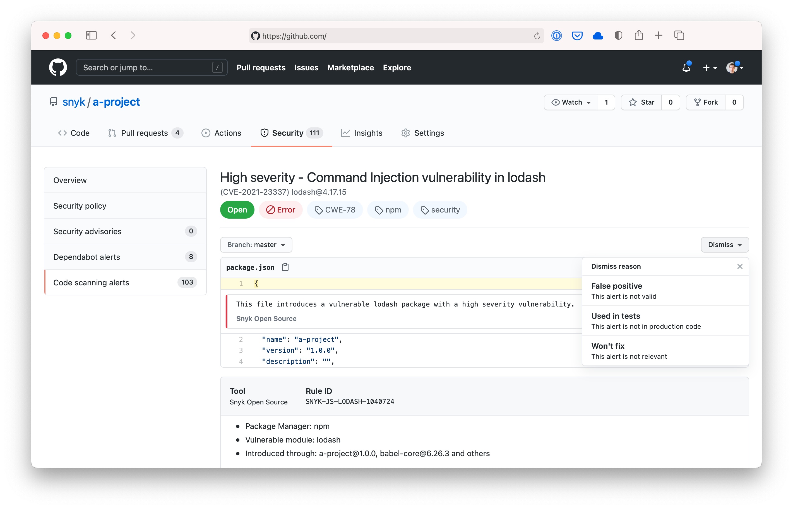

<!--
WARNING: This file is generated, do not edit! Edit _templates/BASE.md.erb instead.
-->

# Snyk GitHub Actions


A set of [GitHub Action](https://github.com/features/actions) for using [Snyk](https://snyk.co/SnykGH) to check for
vulnerabilities in your GitHub projects. A different action is required depending on which language or build tool
you are using.

## Supported Actions


- [CocoaPods](cocoapods)
- [elixir-1.18](elixir-1.18)
- [Golang](golang)
- [Gradle](gradle)
- [gradle-8-jdk17](gradle-8-jdk17)
- [gradle-9-jdk17](gradle-9-jdk17)
- [gradle-8-jdk21](gradle-8-jdk21)
- [gradle-9-jdk21](gradle-9-jdk21)
- [gradle-8-jdk24](gradle-8-jdk24)
- [gradle-9-jdk24](gradle-9-jdk24)
- [Maven](maven)
- [Maven-3-jdk-11](maven-3-jdk-11)
- [Maven-3-jdk-17](maven-3-jdk-17)
- [Maven-3-jdk-21](maven-3-jdk-21)
- [Maven-3-jdk-24](maven-3-jdk-24)
- [Node](node)
- [PHP](php)
- [Python](python)
- [Python-3.9](python-3.9)
- [Python-3.10](python-3.10)
- [Python-3.11](python-3.11)
- [Python-3.12](python-3.12)
- [Ruby](ruby)
- [SBT1.10.0-Scala3.4.2](sbt1.10.0-scala3.4.2)
- [Docker](docker)
- [Infrastructure as Code](iac)
- [Setup](setup)

Here's an example of using one of the Actions, in this case to test a Node.js project:

```yaml
name: Example workflow using Snyk
on: push
jobs:
  security:
    runs-on: ubuntu-latest
    steps:
      - uses: actions/checkout@master
      - name: Run Snyk to check for vulnerabilities
        uses: snyk/actions/node@master
        env:
          SNYK_TOKEN: ${{ secrets.SNYK_TOKEN }}
```

If you want to send data to Snyk, and be alerted when new vulnerabilities are discovered, you can run [Snyk monitor](https://support.snyk.io/hc/en-us/articles/360000920818-What-is-the-difference-between-snyk-test-protect-and-monitor-) like so:

```yaml
name: Example workflow using Snyk
on: push
jobs:
  security:
    runs-on: ubuntu-latest
    steps:
      - uses: actions/checkout@master
      - name: Run Snyk to check for vulnerabilities
        uses: snyk/actions/node@master
        env:
          SNYK_TOKEN: ${{ secrets.SNYK_TOKEN }}
        with:
          command: monitor
```

See the individual Actions linked above for per-language instructions.

Note that GitHub Actions will not pass on secrets set in the repository to forks being used in pull requests, and so the Snyk actions that require the token will fail to run.

### Bring your own development environment

The per-language Actions automatically install all the required development tools for Snyk to determine the correct dependencies and hence vulnerabilities from different language environments. If you have a workflow where you already have those installed then you can instead use the `snyk/actions/setup` Action to just install [Snyk CLI][cli-gh]:

```yaml
name: Snyk example
on: push
jobs:
  security:
    runs-on: ubuntu-latest
    steps:
      - uses: actions/checkout@master
      - uses: snyk/actions/setup@master
      - uses: actions/setup-go@v1
        with:
          go-version: '1.13'
      - name: Snyk monitor
        run: snyk test
        env:
          SNYK_TOKEN: ${{ secrets.SNYK_TOKEN }}
```

The example here uses `actions/setup-go` you would need to select the right actions to install the relevant development requirements for your project. If you are already using the same pipeline to build and test your application you're likely already doing so.

### Getting your Snyk token

The Actions example above refer to a Snyk API token:

```yaml
env:
  SNYK_TOKEN: ${{ secrets.SNYK_TOKEN }}
```

Every Snyk account has this token. Once you [create an account](https://snyk.co/SignUpGH) you can find it in one of two ways:

1. In the UI, go to your Snyk account's [settings page](https://app.snyk.io/account) and retrieve the API token, as shown in the following [Revoking and regenerating Snyk API tokens](https://support.snyk.io/hc/en-us/articles/360004008278-Revoking-and-regenerating-Snyk-API-tokens).
2. If you're using the [Snyk CLI](https://support.snyk.io/hc/en-us/articles/360003812458-Getting-started-with-the-CLI) locally you can retrieve it by running `snyk config get api`.

### GitHub Code Scanning support

All Snyk GitHub Actions support integration with GitHub Code Scanning to show vulnerability information in the GitHub Security tab. You can see full details on the individual action READMEs linked above.



### Continuing on error

The above examples will fail the workflow when issues are found. If you want to ensure the Action continues, even if Snyk finds vulnerabilities, then [continue-on-error](https://docs.github.com/en/actions/reference/workflow-syntax-for-github-actions#jobsjob_idstepscontinue-on-error) can be used..

```yaml
name: Example workflow using Snyk with continue on error
on: push
jobs:
  security:
    runs-on: ubuntu-latest
    steps:
      - uses: actions/checkout@master
      - name: Run Snyk to check for vulnerabilities
        uses: snyk/actions/node@master
        continue-on-error: true
        env:
          SNYK_TOKEN: ${{ secrets.SNYK_TOKEN }}
```
### Development

This repository uses an automated build system to generate GitHub Actions and their corresponding test workflows.
The source of truth is the [variants](./variants) file containing references to Docker tags based off of what is published by [snyk-images](https://github.com/snyk/snyk-images).
To regenerate all actions and tests after making changes to the templates:

```bash
ruby build.rb
```

This will:
- Generate all variant actions from the templates in `_templates/`
- Generate corresponding test workflows in `.github/workflows/` for each variant
- Update the main README with the list of supported variants


## Deprecated Actions

The following actions are deprecated and no longer supported by Snyk or the downstream provider. Please see the [Supported Actions](#supported-actions) section above for alternatives. If you need an action that is not currently supported, we welcome pull requests to add new language support.


- [dotNET](dotnet)
- [Gradle-jdk11](gradle-jdk11)
- [Gradle-jdk12](gradle-jdk12)
- [Gradle-jdk14](gradle-jdk14)
- [Gradle-jdk16](gradle-jdk16)
- [Gradle-jdk17](gradle-jdk17)
- [Gradle-jdk21](gradle-jdk21)
- [Maven-3-jdk-20](maven-3-jdk-20)
- [Maven-3-jdk-22](maven-3-jdk-22)
- [Python-3.6](python-3.6)
- [Python-3.7](python-3.7)
- [Python-3.8](python-3.8)
- [Scala](scala)


## Contributing

To ensure the long-term stability and quality of this project, we are moving to a closed-contribution model effective August 2025. This change allows our core team to focus on a centralized development roadmap and rigorous quality assurance, which is essential for a component with such extensive usage.

All of our development will remain public for transparency. We thank the community for its support and valuable contributions.

## Getting Support

GitHub issues have been disabled on this repository as part of our move to a closed-contribution model. The Snyk support team does not actively monitor GitHub issues on any Snyk development project.

For help with Snyk products, please use the [Snyk support page](https://support.snyk.io/), which is the fastest way to get assistance.

[cli-gh]: https://github.com/snyk/snyk 'Snyk CLI'
[cli-ref]: https://docs.snyk.io/snyk-cli/cli-reference 'Snyk CLI Reference documentation'

