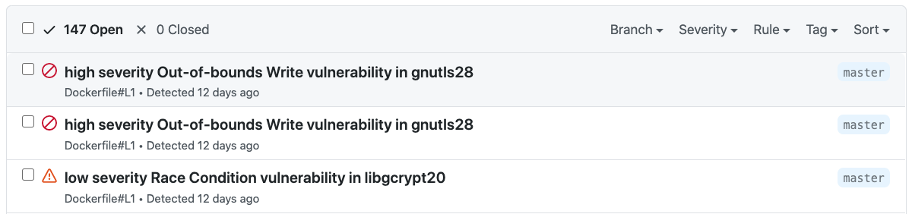

# Snyk Docker Action

A [GitHub Action](https://github.com/features/actions) for using [Snyk](https://snyk.io) to check for
vulnerabilities in your Docker images.

You can use the Action as follows:

```yaml
name: Example workflow for Docker using Snyk 
on: push
jobs:
  security:
    runs-on: ubuntu-latest
    steps:
    - name: Run Snyk to check Docker image for vulnerabilities
      uses: snyk/actions/docker@master
      env:
        SNYK_TOKEN: ${{ secrets.SNYK_TOKEN }}
      with:
        image: your/image-to-test
```

The Snyk Docker Action has properties which are passed to the underlying image. These are
passed to the action using `with`.

| Property | Default | Description |
| --- | --- | --- |
| args |   | Override the default arguments to the Snyk image |
| command | test | Specifiy which command to run, for instance test or monitor |
| image |    | The name of the image to test |
| json | false | In addition to the stdout, save the results as snyk.json |
| sarif | true | In addition to the stdout, save the results as snyk.sarif |

For example, you can choose to only report on high severity vulnerabilities.

```yaml
name: Example workflow for Docker using Snyk 
on: push
jobs:
  security:
    runs-on: ubuntu-latest
    steps:
    - name: Run Snyk to check Docker images for vulnerabilities
      uses: snyk/actions/docker@master
      env:
        SNYK_TOKEN: ${{ secrets.SNYK_TOKEN }}
      with:
        image: your/image-to-test
        args: --severity-threshold=high
```

The Docker Action also supports integrating with GitHub Code Scanning and can show issues in the GitHub Security tab. As long as you reference a Dockerfile with `--file=Dockerfile` then a `snyk.sarif` file will be generated which can be uploaded to GitHub Code Scanning.



```yaml
name: Snyk Container
on: push
jobs:
  snyk:
    runs-on: ubuntu-latest
    steps:
    - uses: actions/checkout@v2
    - name: Build a Docker image
      run: docker build -t your/image-to-test .
    - name: Run Snyk to check Docker image for vulnerabilities
      # Snyk can be used to break the build when it detects vulnerabilities.
      # In this case we want to upload the issues to GitHub Code Scanning
      continue-on-error: true
      uses: snyk/actions/docker@master
      env:
        # In order to use the Snyk Action you will need to have a Snyk API token.
        # More details in https://github.com/snyk/actions#getting-your-snyk-token
        # or you can signup for free at https://snyk.io/login
        SNYK_TOKEN: ${{ secrets.SNYK_TOKEN }}
      with:
        image: your/image-to-test
        args: --file=Dockerfile
    - name: Upload result to GitHub Code Scanning
      uses: github/codeql-action/upload-sarif@v2
      with:
        sarif_file: snyk.sarif
```
