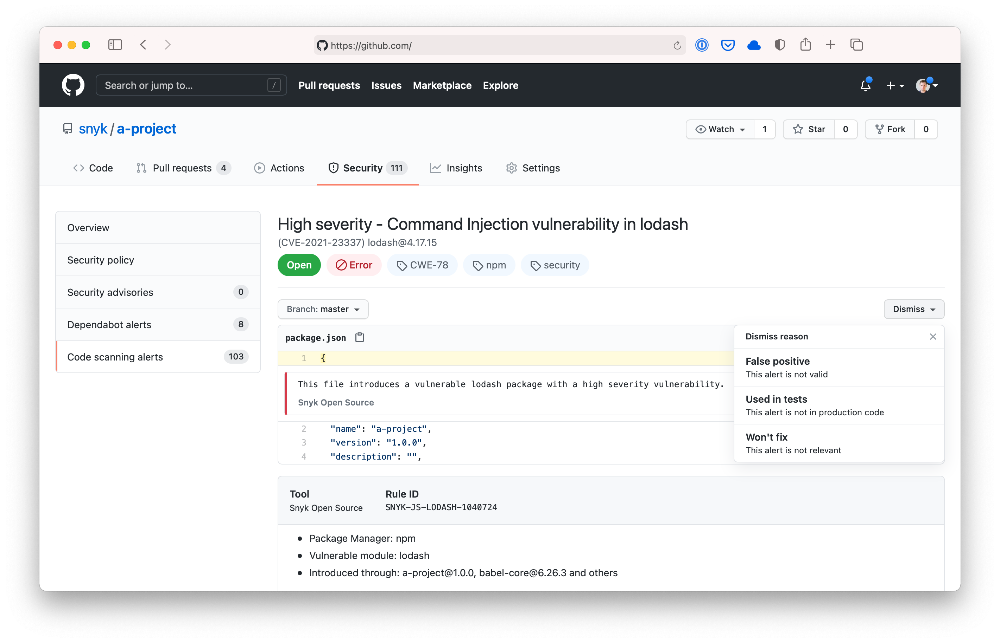

# Snyk Node Action

A [GitHub Action](https://github.com/features/actions) for using [Snyk](https://snyk.co/SnykGH) to check for
vulnerabilities in your Node projects. This Action is based on the [Snyk CLI][cli-gh] and you can use [all of its options and capabilities][cli-ref] with the `args`.

You can use the Action as follows:

```yaml
name: Example workflow for Node using Snyk
on: push
jobs:
  security:
    runs-on: ubuntu-latest
    steps:
      - uses: actions/checkout@master
      - name: Run Snyk to check for vulnerabilities
        uses: snyk/actions/node@master
        env:
          SNYK_TOKEN: ${{ secrets.SNYK_TOKEN }}
```

## Properties

The Snyk Node Action has properties which are passed to the underlying image. These are passed to the action using `with`.

| Property | Default | Description                                                                                         |
| -------- | ------- | --------------------------------------------------------------------------------------------------- |
| args     |         | Override the default arguments to the Snyk image. See [Snyk CLI reference for all options][cli-ref] |
| command  | test    | Specify which command to run, for instance test or monitor                                          |
| json     | false   | In addition to the stdout, save the results as snyk.json                                            |

For example, you can choose to only report on high severity vulnerabilities.

```yaml
name: Example workflow for Node using Snyk
on: push
jobs:
  security:
    runs-on: ubuntu-latest
    steps:
      - uses: actions/checkout@master
      - name: Run Snyk to check for vulnerabilities
        uses: snyk/actions/node@master
        env:
          SNYK_TOKEN: ${{ secrets.SNYK_TOKEN }}
        with:
          args: --severity-threshold=high
```

## Uploading Snyk scan results to GitHub Code Scanning

Using `--sarif-file-output` [Snyk CLI flag][cli-ref] and the [official GitHub SARIF upload action](https://docs.github.com/en/code-security/secure-coding/uploading-a-sarif-file-to-github), you can upload Snyk scan results to the GitHub Code Scanning.



The Snyk Action will fail when vulnerabilities are found. This would prevent the SARIF upload action from running, so we need to introduce a [continue-on-error](https://docs.github.com/en/actions/reference/workflow-syntax-for-github-actions#jobsjob_idstepscontinue-on-error) option like this:

```yaml
name: Example workflow for Node using Snyk
on: push
jobs:
  security:
    runs-on: ubuntu-latest
    steps:
      - uses: actions/checkout@master
      - name: Run Snyk to check for vulnerabilities
        uses: snyk/actions/node@master
        continue-on-error: true # To make sure that SARIF upload gets called
        env:
          SNYK_TOKEN: ${{ secrets.SNYK_TOKEN }}
        with:
          args: --sarif-file-output=snyk.sarif
      - name: Upload result to GitHub Code Scanning
        uses: github/codeql-action/upload-sarif@v2
        with:
          sarif_file: snyk.sarif
```

Made with 💜 by Snyk

[cli-gh]: https://github.com/snyk/snyk 'Snyk CLI'
[cli-ref]: https://snyk.io/docs/using-snyk?utm_campaign=docs&utm_medium=github&utm_source=cli 'Snyk CLI Reference documentation'
